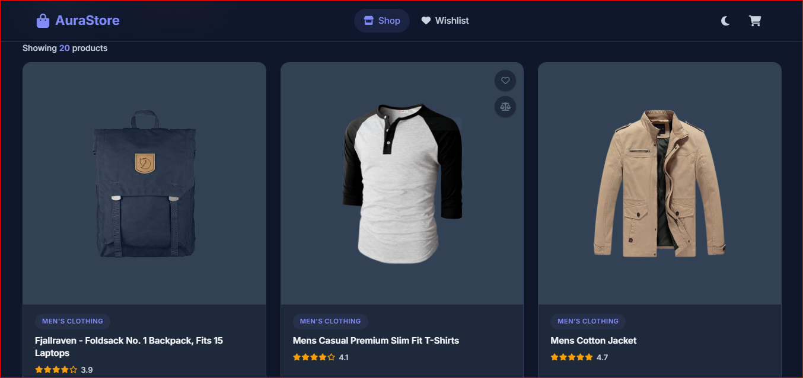
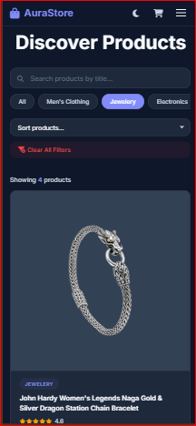
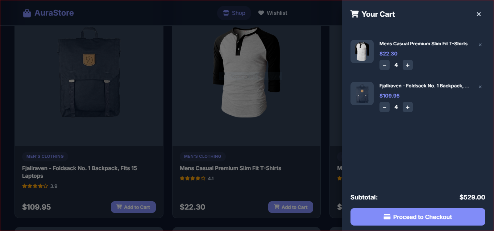

# AuraStore — E-Commerce Product Store

AuraStore is a fully responsive E-Commerce Product Store built using **HTML5, CSS3, and Vanilla JavaScript**. The application fetches real product data from the Fake Store API and provides product browsing, filtering, sorting, cart management, dark/light mode, and localStorage persistence without using any frameworks or external JavaScript libraries.

---


## ✨ Features

### Product Listing

* Fetches products from Fake Store API using `fetch()` and `async/await`
* Responsive product grid
* Dynamic product count display
* Skeleton loading animation
* API error handling with retry button
* Product image fallback handling

### Search, Filter & Sort

* Real-time product search
* Case-insensitive filtering
* Dynamically generated category filters
* Sort by:

  * Price Low to High
  * Price High to Low
  * Rating Best First
  * Name A to Z
* Clear All Filters functionality
* No Products Found state

### Product Detail Modal

* Full product image
* Full product title and description
* Category badge
* Rating and review count
* Quantity selector
* Add to Cart functionality
* Close via button, overlay click, or Escape key

### Shopping Cart

* Cart item count badge
* Sliding cart drawer
* Quantity controls
* Remove item functionality
* Dynamic subtotal calculation
* Empty cart state
* Checkout functionality
* Order confirmation modal

### LocalStorage Persistence

* Cart persists after page refresh
* Product quantities persist after refresh
* Cart badge restores automatically
* Theme preference persists after refresh

### Dark / Light Mode

* Theme toggle button
* Sun and Moon icons
* Theme preference stored in localStorage
* Theme restored automatically on page load

### Responsive Design

* Mobile-first responsive layout
* Hamburger navigation menu
* Full-width cart drawer on mobile
* Responsive product grid
* Scrollable modals on small screens

### Bonus Features

* Wishlist with localStorage persistence
* Load More functionality
* Product comparison modal
* Debounced search using closures
* Smooth animations and transitions

---

## 📸 Screenshots

### Desktop Product Grid



### Mobile Responsive View




### Cart Drawer Open



---

## 🛠 Technologies Used

* HTML5
* CSS3
* Vanilla JavaScript (ES6+)
* Fake Store API
* LocalStorage
* Google Fonts
* Font Awesome

---

## 📂 Project Structure

```text
ecommerce-store/
│
├── index.html
│
├── css/
│   ├── style.css
│   ├── dark-mode.css
│   └── skeleton.css
│
├── js/
│   ├── app.js
│   ├── api.js
│   ├── products.js
│   ├── cart.js
│   ├── filters.js
│   └── ui.js
│
└── README.md
```

---

## 🚀 How to Run Locally

### Option 1: Open Directly

1. Download or clone the repository.
2. Open the project folder.
3. Open `index.html` in your browser.

### Option 2: Using VS Code Live Server

1. Clone the repository:
2. Open the project in VS Code.
3. Install the Live Server extension.
4. Right-click `index.html`.
5. Select **Open with Live Server**.

---

## 📚 What I Learned

This project helped me gain practical experience working with REST APIs using `fetch()` and `async/await`. I improved my understanding of DOM manipulation, event handling, localStorage, responsive design, and state management in Vanilla JavaScript. One of the biggest challenges was making search, category filtering, and sorting work together without conflicting with each other. Implementing cart persistence, modal interactions, and debounced search also helped me write cleaner and more organized code while following strict project requirements.

---

## 🎥 Video Walkthrough

**Video Link:**
[https://youtu.be/GC8E0Vt3yAg]

The walkthrough demonstrates:

* Product loading
* Search functionality
* Category filtering
* Sorting options
* Product modal
* Add to Cart
* Cart drawer
* Checkout flow
* Dark/Light mode
* Wishlist feature
* Product comparison
* Responsive design
* LocalStorage persistence

---


